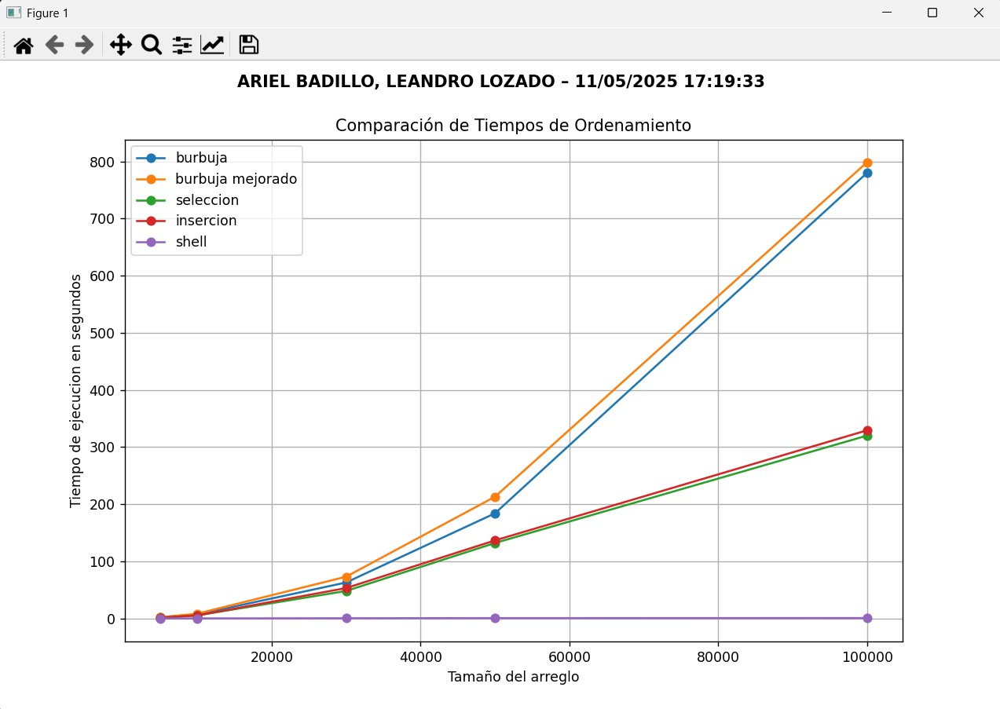

# Práctica de Algoritmos de Ordenamiento  

## 📌 Información General

- **Título:** Teoría de la Complejidad  
- **Asignatura:** Estructura de Datos  
- **Carrera:** Computación  
- **Estudiantes:** Ariel Badillo y Leandro Lozado  
- **Fecha:** Domingo 11 de Mayo  
- **Profesor:** Ing. Pablo Torres  

---

## 🛠️ Descripción

Este proyecto en Python compara el rendimiento de distintos algoritmos de ordenamiento clásicos utilizando tiempos de ejecución medidos experimentalmente.

Los algoritmos implementados son:

- **Burbuja**
- **Burbuja Mejorado (Optimizado con bandera de corte)**
- **Selección**
- **Inserción**
- **Shell Sort**

Características del proyecto:

- Generación de arreglos aleatorios con hasta 100,000 elementos.
- Comparación del rendimiento en diferentes tamaños de entrada.
- Visualización de los resultados en una gráfica utilizando `matplotlib`.
- Separación clara entre la lógica de ordenamiento y la lógica de benchmarking.

---

## 🚀 Ejecución

1. Asegúrate de tener Python  y `matplotlib` instalado:
    ```bash
    pip install matplotlib
    ```

2. Ejecuta el script principal:
    ```bash
    python main.py
    ```

Esto generará una gráfica que muestra los tiempos de ejecución para cada algoritmo en función del tamaño del arreglo.

---

## 🧑‍💻 Ejemplo de Entrada

Funciona
Benchmarking instanciado
Tamaño: 5000 - Metodo: burbuja - Tiempo: 1.839377 segundos
Tamaño: 5000 - Metodo: burbuja mejorado - Tiempo: 2.097580 segundos
Tamaño: 5000 - Metodo: seleccion - Tiempo: 1.327879 segundos
Tamaño: 5000 - Metodo: insercion - Tiempo: 1.314255 segundos
Tamaño: 5000 - Metodo: shell - Tiempo: 0.027960 segundos
Tamaño: 10000 - Metodo: burbuja - Tiempo: 6.920994 segundos
Tamaño: 10000 - Metodo: burbuja mejorado - Tiempo: 8.314577 segundos
Tamaño: 10000 - Metodo: seleccion - Tiempo: 5.397149 segundos
Tamaño: 10000 - Metodo: insercion - Tiempo: 5.235683 segundos
Tamaño: 10000 - Metodo: shell - Tiempo: 0.075683 segundos
Tamaño: 30000 - Metodo: burbuja - Tiempo: 62.921220 segundos
Tamaño: 30000 - Metodo: burbuja mejorado - Tiempo: 73.043931 segundos
Tamaño: 30000 - Metodo: seleccion - Tiempo: 48.082474 segundos
Tamaño: 30000 - Metodo: insercion - Tiempo: 53.161619 segundos
Tamaño: 30000 - Metodo: shell - Tiempo: 0.340011 segundos
Tamaño: 50000 - Metodo: burbuja - Tiempo: 183.956650 segundos
Tamaño: 50000 - Metodo: burbuja mejorado - Tiempo: 212.944460 segundos
Tamaño: 50000 - Metodo: seleccion - Tiempo: 132.048211 segundos
Tamaño: 50000 - Metodo: insercion - Tiempo: 136.550789 segundos
Tamaño: 50000 - Metodo: shell - Tiempo: 0.591179 segundos
Tamaño: 100000 - Metodo: burbuja - Tiempo: 780.062075 segundos
Tamaño: 100000 - Metodo: burbuja mejorado - Tiempo: 798.567853 segundos
Tamaño: 100000 - Metodo: seleccion - Tiempo: 320.062214 segundos
Tamaño: 100000 - Metodo: insercion - Tiempo: 329.305965 segundos
Tamaño: 100000 - Metodo: shell - Tiempo: 0.683319 segundos

## Grafica De Eficiencia de los Métodos


## 📊 Conclusiones (Notación Big-O)

```plaintext
- Para Leandro, el algoritmo Shell Sort es el más eficiente, ya que logra un equilibrio entre simplicidad y rendimiento. 
Presenta una complejidad promedio inferior a O(n²), cercana a O(n log² n), y en la práctica fue significativamente más rápido en todos los tamaños de entrada probados,especialmente a partir de 10,000 elementos. 
Además, no requiere estructuras adicionales como Merge o Quick Sort, lo que lo hace ideal para implementaciones rápidas y eficientes.

- Para Ariel, el algoritmo de Inserción es el más valioso debido a su eficiencia en arreglos pequeños o parcialmente ordenados. 
Aunque su complejidad es O(n²) en el peor caso, en la práctica mostró buen rendimiento para tamaños menores a 10,000, con un código claro y fácilmente adaptable. Ariel considera que es un excelente algoritmo para enseñar fundamentos de ordenamiento, ya que combina claridad conceptual con un comportamiento aceptable en muchos escenarios reales.


